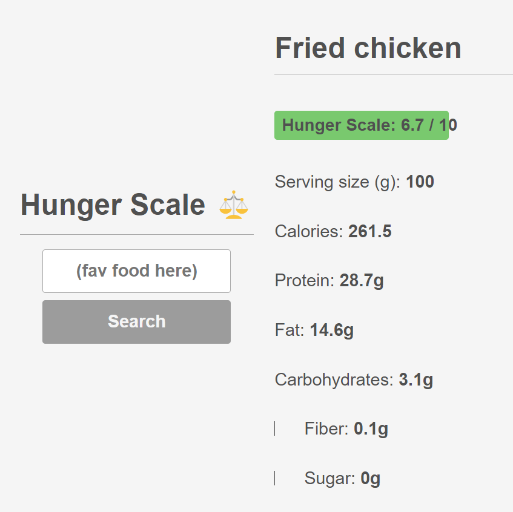

# Hunger Scale

An informative app that uses nutritional data to determine relative satiety (fullness) of various foods.

Satiety: a state or condition of fullness; the opposite of hunger.

When it comes to food, some caloric sources (like high fiber and protein) are
known to cause greater satisfaction/fullness, whereas others (like high sugar) are
not. This app provides as easy way to compare different foods to see which ones
are more likely to be satisfying.

## Tenchnologies Used

- React
- CSS
- Calorie Ninjas API

## Features

- Produces fullness rating (scale 1 - 10) for any food in the database
- Standardized to 100g for consistent comparisons
- Displays macronutrient data for reference

## How To Use

1. Type in any food you want to see
2. Press enter or click "Search"
3. That's it! Fullness rating and macronutrient data is shown on the right

